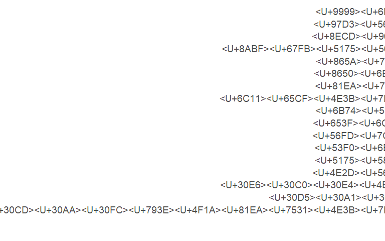

# Introduction

Jarek received an excel file that scraped tweets from 2021. This file is originally 10 GB, so we will isolate the tweets that focus on Attack on Titan. Then we will use natural language processing to see if there are any other interesting keywords that pop up. Finally, we will count how often relevant keywords are used in these tweets to get a sense of what was most popularly being spoken about.


Note that due to difficulties with RMarkdown and non-English characters, this notebook may not render characters and graphs properly. But the graphs correctly rendered in the console will be uploaded to this project's GitHub.

---

# Importing libraries

The libraries that will be used are as follows.


```r
# Import library
library(tidyverse)
library(udpipe)
library(wordcloud2)
```

---

# Subsetting Data

## Data import
This dataset is huge - about 10 GB. So we will start by importing it and immediately trying to make it as easy to manage as possible.


```r
# Import data
data10 <- read_csv('data/tweets.csv')
```

```
## Parsed with column specification:
## cols(
##   .default = col_double(),
##   created_at = col_character(),
##   extended_full_text = col_character(),
##   user_screen_name = col_character(),
##   user_name = col_character(),
##   user_location = col_character(),
##   user_created_at = col_character(),
##   user_verified = col_logical(),
##   source = col_character(),
##   truncated = col_logical(),
##   in_reply_to_screen_name = col_character(),
##   contributors = col_logical(),
##   is_quote_status = col_logical(),
##   favorited = col_logical(),
##   retweeted = col_logical(),
##   filter_level = col_character(),
##   lang = col_character(),
##   possibly_sensitive = col_logical(),
##   withheld_copyright = col_logical(),
##   place_name = col_character(),
##   text = col_character()
##   # ... with 11 more columns
## )
```

```
## See spec(...) for full column specifications.
```

```r
head(data10)
```

```
## # A tibble: 6 x 60
##   created_at   timestamp_ms      id extended_full_text  user_id user_screen_name
##   <chr>               <dbl>   <dbl> <chr>                 <dbl> <chr>           
## 1 Tue Apr 20 ~      1.62e12 1.38e18 "<U+4ECA><U+65E5><U+4E88><U+5B9A><U+3042><U+308B><U+FF1F>\n~  1.31e18 ORV3wcHUZEo99DV 
## 2 Tue Apr 20 ~      1.62e12 1.38e18 "<U+4FFA><U+304C>!<U+4FFA><U+3060><U+3051><U+304C>!~  5.84e 8 kenzakikan_bot  
## 3 Tue Apr 20 ~      1.62e12 1.38e18 "<U+30A2><U+30E9><U+30FC><U+30E0><U+30BB><U+30C3><U+30C8><U+3057>~  1.14e 9 03hyuga03       
## 4 Tue Apr 20 ~      1.62e12 1.38e18 "@shoooota0101 <U+304A>~  1.20e18 GOLF4220        
## 5 Tue Apr 20 ~      1.62e12 1.38e18 "RT @yuzk_y: <U+3010><U+8B72>~  1.97e 9 sssxsss_ksg     
## 6 Tue Apr 20 ~      1.62e12 1.38e18 "RT @raaalondon: «~ 1.06e18 raaalondon      
## # ... with 54 more variables: user_name <chr>, user_followers_count <dbl>,
## #   user_location <chr>, user_created_at <chr>, user_friends_count <dbl>,
## #   user_statuses_count <dbl>, user_verified <lgl>, id_str <dbl>, source <chr>,
## #   truncated <lgl>, in_reply_to_status_id <dbl>,
## #   in_reply_to_status_id_str <dbl>, in_reply_to_user_id_str <dbl>,
## #   in_reply_to_screen_name <chr>, contributors <lgl>, is_quote_status <lgl>,
## #   quote_count <dbl>, reply_count <dbl>, retweet_count <dbl>, ...
```


## Data Preparation
There is a ton of metadata, but for the analysis, we only care about the text of the tweets and the timestamp. We will immediately save this so that we don't have to reimport the huge file if anything breaks.


```r
# Extract relevant columns: text and time posted
small10 <- data10 %>%
  select(text, created_at)
head(small10)
```

```
## # A tibble: 6 x 2
##   text                                                   created_at             
##   <chr>                                                  <chr>                  
## 1 "<U+4ECA><U+65E5><U+4E88><U+5B9A><U+3042><U+308B><U+FF1F>\n<U+4F1A><U+3046><U+8A71><U+304C><U+3057><U+305F><U+3044><U+306E><U+3060><U+3002>\n<U+266A><U+4ECA><U+3057><U+304B><U+306A><U+3044><U+3093>~  Tue Apr 20 23:16:52 +0~
## 2 "<U+4FFA><U+304C>!<U+4FFA><U+3060><U+3051><U+304C>!<U+5263><U+88C2><U+3060>!!"                           Tue Apr 20 23:16:52 +0~
## 3 "<U+30A2><U+30E9><U+30FC><U+30E0><U+30BB><U+30C3><U+30C8><U+3057><U+3066><U+306A><U+304B><U+3063><U+305F><U+306E><U+304B><U+306A>\U0001f602<U+3068><U+308A><U+3042><U+3048><U+305A>~ Tue Apr 20 23:16:52 +0~
## 4 "@shoooota0101 <U+304A><U+4E92><U+3044><U+9811><U+5F35><U+308D>\U0001f4aa"                 Tue Apr 20 23:16:52 +0~
## 5 "RT @yuzk_y: <U+3010><U+8B72><U+6E21><U+5E0C><U+671B><U+3011>\n<U+3042><U+3093><U+3055><U+3093><U+3076><U+308B><U+30B9><U+30BF><U+30FC><U+30BA> <U+3042><U+3093>~  Tue Apr 20 23:16:52 +0~
## 6 "RT @raaalondon: «<U+4E94><U+4F0F>»\n<U+203B><U+5996><U+7CBE><U+5316> 524<U+30D5><U+30A7><U+30A2><U+30EA><U+30FC><U+30BA> http~ Tue Apr 20 23:16:52 +0~
```

```r
# Save full "relevant columns" as CSV
write_excel_csv(small10, "data/twitter10_text_time.csv")
```

And the code to reimport is here, if necessary.


```r
# Read smaller CSV
# small10 <- read_csv("data/twitter10_text_time.csv")
```

## Subset data with references to AOT

We are going to pull out the tweets that, either through the use of hashtags or explicit text, refer to AOT. Many tweets in Japanese still use English in their tweets.


```r
small10_key <- small10 %>%
  filter(
    grepl('進撃の巨人', text) | 
      grepl('進撃', text) | 
      grepl('巨人', text) |
      grepl('SNK', text) |
      grepl('Shingeki no Kyojin', text) |
      grepl('Attack on Titan', text) |
      grepl('Titan', text) |
      grepl('AOT', text) |
      grepl('AttackOnTitan', text) |
      grepl('ShingekinoKyojin', text) |
      grepl('Shingeki', text)
      
  )
head(small10_key)
```

```
## # A tibble: 6 x 2
##   text                                                   created_at             
##   <chr>                                                  <chr>                  
## 1 "RT @artaota_info: ARTAOTA<U+3092><U+30D7><U+30ED><U+30C7><U+30E5><U+30FC><U+30B9><U+3057><U+3066><U+3044><U+308B>MUZ A~ Sun Apr 11 08:24:43 +0~
## 2 "RT @Mushiyo07: <U+9032><U+6483><U+306E><U+5DE8><U+4EBA><U+660E><U+65E5><U+5B8C><U+7D50><U+3002>\n<U+7269><U+8A9E><U+306F><U+6C38><U+9060><U+306B>…!~ Thu Apr 08 13:30:20 +0~
## 3 "RT @randomsakuga: Key Animation: Yasuyuki Ebara (<U+6C5F>~  Sat Apr 10 05:03:36 +0~
## 4 "@AOTO83280245 <U+79C1><U+3082>YOASOBI<U+5927><U+597D><U+304D><U+3067><U+3059><U+2755><U+3053><U+3061><U+3089><U+3053><U+305D><U+3088><U+308D><U+3057>~ Sat Apr 10 05:05:02 +0~
## 5 "RT @Cat_Ice_: \U0001f37d\U0001f942<U+30C1><U+30D3><U+30EA><U+30F4><U+30A1><U+30CF><U+30F3>\U00~ Thu Apr 08 13:30:40 +0~
## 6 "RT @HourlyShounen: <U+3010><U+9032><U+6483><U+306E><U+5DE8><U+4EBA><U+3011>Bertolt Hoover Jiyu~ Tue Apr 20 19:17:28 +0~
```

Save these tweets for later reimport.


```r
# Save keyword tweets to CSV
write_excel_csv(small10_key, "data/twitter10_text_time_keywords.csv")
```

Now, we will clean up the workspace to proceed to the Keyword Analysis.


```r
rm(data10) 
rm(small10)
```

---

# Natural Language Processing
## Prepare data

We are reimporting the data as its own data file, if necessary.


```r
# Import data
# data <- read_csv("data/twitter10_text_time_keywords.csv")
```

Next, we are going to set up the Japanese language model that will parse out the grammar used in the tweets. 


```r
## Set up Japanese language model
jl <- udpipe_download_model(language = "japanese")
```

```
## Downloading udpipe model from https://raw.githubusercontent.com/jwijffels/udpipe.models.ud.2.5/master/inst/udpipe-ud-2.5-191206/japanese-gsd-ud-2.5-191206.udpipe to S:/GitHub/AOT-Fandom-Politics/2021 Twitter API Data/japanese-gsd-ud-2.5-191206.udpipe
```

```
##  - This model has been trained on version 2.5 of data from https://universaldependencies.org
```

```
##  - The model is distributed under the CC-BY-SA-NC license: https://creativecommons.org/licenses/by-nc-sa/4.0
```

```
##  - Visit https://github.com/jwijffels/udpipe.models.ud.2.5 for model license details.
```

```
##  - For a list of all models and their licenses (most models you can download with this package have either a CC-BY-SA or a CC-BY-SA-NC license) read the documentation at ?udpipe_download_model. For building your own models: visit the documentation by typing vignette('udpipe-train', package = 'udpipe')
```

```
## Downloading finished, model stored at 'S:/GitHub/AOT-Fandom-Politics/2021 Twitter API Data/japanese-gsd-ud-2.5-191206.udpipe'
```

```r
str(jl)
```

```
## 'data.frame':	1 obs. of  5 variables:
##  $ language        : chr "japanese-gsd"
##  $ file_model      : chr "S:/GitHub/AOT-Fandom-Politics/2021 Twitter API Data/japanese-gsd-ud-2.5-191206.udpipe"
##  $ url             : chr "https://raw.githubusercontent.com/jwijffels/udpipe.models.ud.2.5/master/inst/udpipe-ud-2.5-191206/japanese-gsd-"| __truncated__
##  $ download_failed : logi FALSE
##  $ download_message: chr "OK"
```

```r
udmodel_japanese <- udpipe_load_model(file = jl$file_model)
annotated_data <- data.frame(udpipe_annotate(udmodel_japanese, small10_key$text))
```

This file took about 10 minutes to create, so we will be saving the output as a separate file so we can reload it in if anything happens.


```r
# Save NLP file
saveRDS(annotated_data, file = "data/annotated_jpn_keyword_analysis.rds")

# Reload NLP file if necessary
# annotated_data <- readRDS(file = "data/annotated_jpn_keyword_analysis.rds")
```

## Cleaning data

Next, we will be parsing through the results and further subsetting relevant information. Based on the pre-selected keywords as well as Japanese grammar, Jarek decided it would be best to focus on nouns and proper nouns in the dataset.


```r
# Subset nouns
noun_data <- annotated_data %>%
  subset(upos == "NOUN" | upos == "PROPN")
```

Then, we remove any other Twitter idiosyncracies that slipped through, such as 'RT' or username handles.


```r
# Clean data 
cleaned_data <- noun_data %>%
  subset(!grepl('@', token) & # remove usernames
           token != "RT" & # remove retweet reference
           token != "_" & # remove underscores
           token != "お" & # remove a particle that slipped in
           token != "/" & # remove slashes
           token != "×" & # remove special characters
           !grepl( 'http', token, fixed = TRUE) # remove url reference
  )
```

Our next step was to remove references to the baseball team (the Yomiuri Giants) as those tweets were a confounding variable.


```r
# Remove baseball team reference
cleaned_data <- cleaned_data %>%
  subset(token != "阪神" & 
           token != "コラボ" &
           token != "giants" &
           token != "baseball"
         ) 
```

Now, we take a peek at what words pop up in the first word cloud.


```r
# Generate word cloud
frequency <- txt_freq(cleaned_data$token)
wc1 <- wordcloud2(frequency[1:100,]) # Subset the top 100 words
wc1
```

```{=html}
<div id="htmlwidget-84cb3c09555a166ae0f5" style="width:672px;height:480px;" class="wordcloud2 html-widget"></div>
<script type="application/json" data-for="htmlwidget-84cb3c09555a166ae0f5">{"x":{"word":["日","進撃","巨人","お","プレゼント","KOF","マガ","ご","SNKRS","発売","SNK","jp","月号","NAOTO","4月","Nike","楽しみ","カード","ポスト","AttackOnTitan","さん","キャンペーン","こと","モノカブアプリ","DL","一緒","付録","クリア","会議","ファイル","全員","応募者","紙版","新作","内容","🟡","様","気","シェルミー","夏","XV","Air","EXILE","配本","shingeki","カラー","Titan","週","atmos","カルト","的人","AJ1","先駆","Shingeki","最終回","完結","交換","目","枚","作品","AOT","NIKE","本日","年","シリーズ","最新","人気","中","大人","記念","予定","エレン","モデル","ぃっち","ダイロ","クセンス","ちゃん","Dunk","キャラクタートレーラー","物語","方","人","っぽさ","全開","登場❗️","ウィメンズ","発売🪞","申し訳","求","コラボ","譲","木","店","︎","氏","読者","マ","以降","〜","永遠"],"freq":[712,644,605,599,511,340,330,329,305,300,295,283,283,254,245,230,215,212,211,207,196,190,187,184,184,180,174,173,173,170,170,168,168,148,143,140,108,104,101,95,94,93,92,92,89,89,89,87,86,85,85,85,85,84,84,83,81,77,74,72,70,68,68,65,64,63,63,60,60,59,57,57,57,57,57,57,56,56,56,55,55,55,55,55,55,55,55,54,54,53,53,51,51,51,49,49,48,48,48,47],"fontFamily":"Segoe UI","fontWeight":"bold","color":"random-dark","minSize":0,"weightFactor":0.252808988764045,"backgroundColor":"white","gridSize":0,"minRotation":-0.785398163397448,"maxRotation":0.785398163397448,"shuffle":true,"rotateRatio":0.4,"shape":"circle","ellipticity":0.65,"figBase64":null,"hover":null},"evals":[],"jsHooks":{"render":[{"code":"function(el,x){\n                        console.log(123);\n                        if(!iii){\n                          window.location.reload();\n                          iii = False;\n\n                        }\n  }","data":null}]}}</script>
```


This cloud has a lot of references to the series name which we had originally subsetted on. This makes sense: we selected for these keywords. But to get a better picture of what other topics are being talked about in that context, we will remove those words.


```r
# Remove AOT name references
cleaned_data <- cleaned_data %>%
  subset(token != "進撃" & 
           token != "巨人" & 
           token != "SNK" & 
           token != "shingeki" & 
           token != "No" & 
           token != "Kyojin" & 
           token != "ShingekiNoKyojin" & 
           token != "AOT" & 
           token != "Attack" & 
           token != "on" & 
           token != "Titan" & 
           token != "AttackOnTitan" 
         ) 
```

Now, we will generate the word cloud again and save that file.

*Note*: For some reason, the word cloud that is printing in the notebook is different than the one that is being shown in the terminal in RStudio. So we will save both images.


```r
# Generate word cloud
frequency <- txt_freq(cleaned_data$token)
wc2 <- wordcloud2(frequency[1:150,])
wc2
```

```{=html}
<div id="htmlwidget-3a66f14beac4123baa09" style="width:672px;height:480px;" class="wordcloud2 html-widget"></div>
<script type="application/json" data-for="htmlwidget-3a66f14beac4123baa09">{"x":{"word":["日","進撃","巨人","お","プレゼント","KOF","マガ","ご","SNKRS","発売","jp","月号","NAOTO","4月","Nike","楽しみ","カード","ポスト","さん","キャンペーン","こと","モノカブアプリ","DL","一緒","付録","クリア","会議","ファイル","全員","応募者","紙版","新作","内容","🟡","様","気","シェルミー","夏","XV","Air","EXILE","配本","カラー","週","atmos","カルト","的人","AJ1","先駆","Shingeki","最終回","完結","交換","目","枚","作品","NIKE","本日","年","シリーズ","最新","人気","中","大人","記念","予定","エレン","モデル","ぃっち","ダイロ","クセンス","ちゃん","Dunk","キャラクタートレーラー","物語","方","人","っぽさ","全開","登場❗️","ウィメンズ","発売🪞","申し訳","求","コラボ","譲","木","店","︎","氏","読者","マ","以降","〜","永遠","最終話","フラー","書店","普段","状況","丘","読了","完売","愛読","迷惑","そのような","緊急重版","コンビニ","願い","トレーラー","号","話","巨人明日","Cynthia","Lu","CPFM","Cactus","Plant","Flea","Market","発売🔥","今日","マガジン","気持ち","-","（水","週刊少年","マガ読者","4K","健二郎","明日","ぜ","月","おめ","円","山下","参戦","後","舞","描こ","絵","格ゲーキャラ","居酒屋","️","最高","あと","画像","t","to","三代目"],"freq":[712,644,605,599,511,340,330,329,305,300,283,283,254,245,230,215,212,211,196,190,187,184,184,180,174,173,173,170,170,168,168,148,143,140,108,104,101,95,94,93,92,92,89,87,86,85,85,85,85,84,84,83,81,77,74,72,68,68,65,64,63,63,60,60,59,57,57,57,57,57,57,56,56,56,55,55,55,55,55,55,55,55,54,54,53,53,51,51,51,49,49,48,48,48,47,47,47,47,47,47,46,46,46,46,46,46,46,46,45,45,44,44,43,43,43,43,43,43,43,43,43,43,43,43,42,42,42,42,42,41,41,40,39,39,38,38,38,37,37,36,36,35,35,35,34,34,34,34,33,33],"fontFamily":"Segoe UI","fontWeight":"bold","color":"random-dark","minSize":0,"weightFactor":0.252808988764045,"backgroundColor":"white","gridSize":0,"minRotation":-0.785398163397448,"maxRotation":0.785398163397448,"shuffle":true,"rotateRatio":0.4,"shape":"circle","ellipticity":0.65,"figBase64":null,"hover":null},"evals":[],"jsHooks":{"render":[{"code":"function(el,x){\n                        console.log(123);\n                        if(!iii){\n                          window.location.reload();\n                          iii = False;\n\n                        }\n  }","data":null}]}}</script>
```
               
Now, we will take a look at the full list.


```r
head(frequency)
```

```
##                                        key freq freq_pct
## 1                                 <U+65E5>  712 2.329233
## 2                         <U+9032><U+6483>  644 2.106778
## 3                         <U+5DE8><U+4EBA>  605 1.979194
## 4                                 <U+304A>  599 1.959566
## 5 <U+30D7><U+30EC><U+30BC><U+30F3><U+30C8>  511 1.671683
## 6                                      KOF  340 1.112274
```

```r
write_excel_csv(frequency,'data/NLP_keyword_frequency.csv')
```

An interesting word that pops out is 歴史 (history) at #84. We will add that to the specific keyword analysis.

---

# Keyword Analysis
## Specific keyword analysis

Jarek pre-selected keywords and identified a new one based on the NLP analysis. We are going to filter tweets using those words from the original AOT-subsetted dataset.


```r
# Isolate specific tweets based on keyword
specific_kw <- small10_key %>%
  filter(str_detect(text, "ファン") | # Fan/Fandom
           str_detect(text, "軍隊") | # Army
           str_detect(text, "調査兵団") | # Survey Corps
           str_detect(text, "民族主義") | # Nationalism
           str_detect(text, "虐殺") | # Genocide
           str_detect(text, "韓国") | # Korea
           str_detect(text, "政治") | # Politics
           str_detect(text, "兵士") | # Soldiers
           str_detect(text, "ネオー社会自由主義") | # Neoliberalism
           str_detect(text, "自由") | # Freedom
           str_detect(text, "虚無") | # Nihilism
           str_detect(text, "香港,") | # Hong Kong
           str_detect(text, "国粋") |
           str_detect(text, "ユダヤ人") | # Jewish People
           str_detect(text, "台湾") | # Taiwan
           str_detect(text, "中国") | # China
           str_detect(text, "歴史")) # History

# Save tweets
write_excel_csv(specific_kw, 'data/tweet10_keywords.csv') # Saving with this function preserves the Japanese encoding
```

This leaves us with 1,384 tweets from the original 21,553. Now we are going to count the frequencies of those keywords in these tweets.


```r
# Create list of keywords to get counts for
keywords <- list("ファン","軍隊","調査兵団","民族主義","虐殺","韓国","政治", "兵士","ネオー社会自由主義","自由","虚無","香港","国粋","ユダヤ人","台湾","中国","歴史")

# Get counts for those keywords
keyword_count <- data.frame()
  
for (keyword in keywords) {
  key_count <- length(grep(keyword, specific_kw$text))
  key_table <- data.frame(keyword, key_count)
  colnames(key_table) <- c("Keyword", "Count")
  keyword_count <- rbind(keyword_count, key_table)
}

keyword_count
```

```
##                                                                     Keyword
## 1                                                  <U+30D5><U+30A1><U+30F3>
## 2                                                          <U+8ECD><U+968A>
## 3                                          <U+8ABF><U+67FB><U+5175><U+56E3>
## 4                                          <U+6C11><U+65CF><U+4E3B><U+7FA9>
## 5                                                          <U+8650><U+6BBA>
## 6                                                          <U+97D3><U+56FD>
## 7                                                          <U+653F><U+6CBB>
## 8                                                          <U+5175><U+58EB>
## 9  <U+30CD><U+30AA><U+30FC><U+793E><U+4F1A><U+81EA><U+7531><U+4E3B><U+7FA9>
## 10                                                         <U+81EA><U+7531>
## 11                                                         <U+865A><U+7121>
## 12                                                         <U+9999><U+6E2F>
## 13                                                         <U+56FD><U+7C8B>
## 14                                         <U+30E6><U+30C0><U+30E4><U+4EBA>
## 15                                                         <U+53F0><U+6E7E>
## 16                                                         <U+4E2D><U+56FD>
## 17                                                         <U+6B74><U+53F2>
##    Count
## 1      0
## 2      0
## 3      0
## 4      0
## 5      0
## 6      0
## 7      0
## 8      0
## 9      0
## 10     0
## 11     0
## 12     0
## 13     0
## 14     0
## 15     0
## 16     0
## 17     0
```

Now we will plot the frequencies to see what comes up the most.


```r
# Visualize the data
keyword_count %>%
  ggplot(aes(fill=Keyword,x=reorder(Keyword, Count), y = Count)) +
  geom_bar(stat="identity", show.legend=FALSE) +
  geom_text(aes(label=Count, hjust=-0.3)) +
  xlab("Keyword") + ylab("sqrt(Count)") + 
  theme(axis.text.y=element_text(size=14),
        axis.title=element_text(size=14)) +
  coord_flip()
```

<!-- -->

Since there is a strong right skew to this data, we are going to square-root transform the frequencies just so it can be visualized better.


```r
# Square root the counts for better visualization

keyword_count_transformed <- keyword_count
keyword_count_transformed$Count <- sqrt(keyword_count_transformed$Count)
```

Finally, we are going to visualize the transformed frequency data. The Y-axis will be transformed frequencies, but we will plot the actual counts on top of the bar graph.


```r
# Visualize the data
kw_graph_transformed <- keyword_count_transformed %>%
  ggplot(aes(fill=Keyword,x=reorder(Keyword, Count), y = Count)) +
  geom_bar(stat="identity", show.legend=FALSE) +
  geom_text(aes(label=keyword_count$Count, hjust=-0.3)) +
  xlab("Keyword") + ylab("sqrt(Count)") + 
  theme(axis.text.y=element_text(size=14),
        axis.title=element_text(size=14)) +
  coord_flip()

kw_graph_transformed
```

<!-- -->

---

```r
sessionInfo()
```

```
## R version 4.0.2 (2020-06-22)
## Platform: x86_64-w64-mingw32/x64 (64-bit)
## Running under: Windows 10 x64 (build 19043)
## 
## Matrix products: default
## 
## locale:
## [1] LC_COLLATE=English_United States.1252 
## [2] LC_CTYPE=English_United States.1252   
## [3] LC_MONETARY=English_United States.1252
## [4] LC_NUMERIC=C                          
## [5] LC_TIME=English_United States.1252    
## 
## attached base packages:
## [1] stats     graphics  grDevices utils     datasets  methods   base     
## 
## other attached packages:
##  [1] wordcloud2_0.2.1 udpipe_0.8.8     forcats_0.5.0    stringr_1.4.0   
##  [5] dplyr_1.0.7      purrr_0.3.4      readr_1.3.1      tidyr_1.1.4     
##  [9] tibble_3.1.6     ggplot2_3.3.5    tidyverse_1.3.0 
## 
## loaded via a namespace (and not attached):
##  [1] Rcpp_1.0.7        lubridate_1.7.9   lattice_0.20-41   assertthat_0.2.1 
##  [5] digest_0.6.25     utf8_1.2.2        R6_2.5.1          cellranger_1.1.0 
##  [9] backports_1.1.8   reprex_0.3.0      evaluate_0.14     highr_0.8        
## [13] httr_1.4.2        pillar_1.6.4      rlang_0.4.12      readxl_1.3.1     
## [17] rstudioapi_0.13   data.table_1.14.2 jquerylib_0.1.4   blob_1.2.1       
## [21] Matrix_1.4-0      rmarkdown_2.11    labeling_0.4.2    htmlwidgets_1.5.4
## [25] munsell_0.5.0     broom_0.7.0       compiler_4.0.2    modelr_0.1.8     
## [29] xfun_0.29         pkgconfig_2.0.3   htmltools_0.5.2   tidyselect_1.1.1 
## [33] fansi_1.0.0       crayon_1.4.2      dbplyr_1.4.4      withr_2.4.3      
## [37] grid_4.0.2        jsonlite_1.7.2    gtable_0.3.0      lifecycle_1.0.1  
## [41] DBI_1.1.0         magrittr_2.0.1    scales_1.1.1      cli_3.1.0        
## [45] stringi_1.7.6     farver_2.1.0      fs_1.5.2          xml2_1.3.2       
## [49] bslib_0.3.1       ellipsis_0.3.2    generics_0.1.1    vctrs_0.3.8      
## [53] tools_4.0.2       glue_1.6.0        hms_0.5.3         fastmap_1.1.0    
## [57] yaml_2.2.1        colorspace_2.0-2  rvest_0.3.6       knitr_1.37       
## [61] haven_2.3.1       sass_0.4.0
```

  

