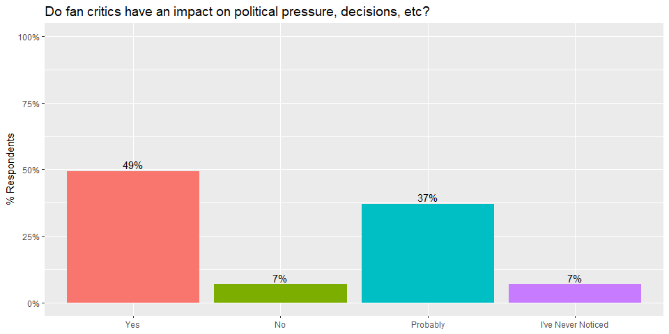
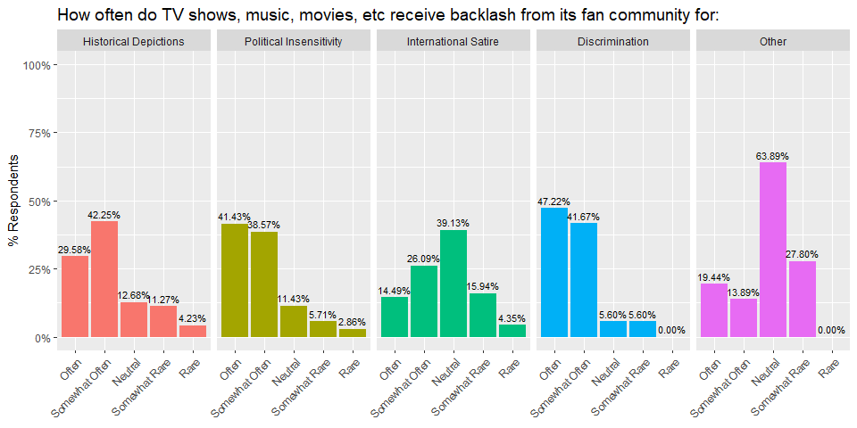
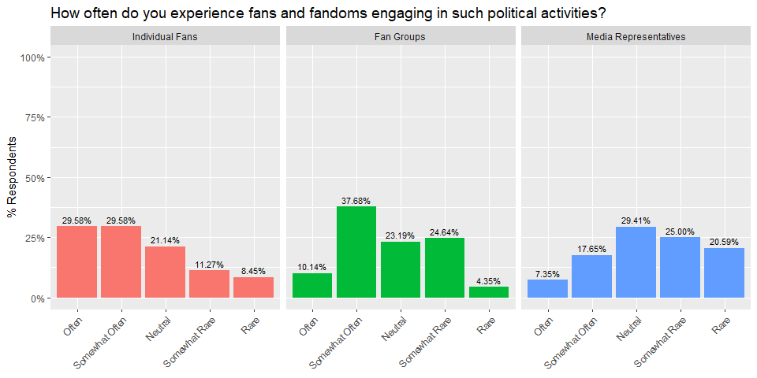
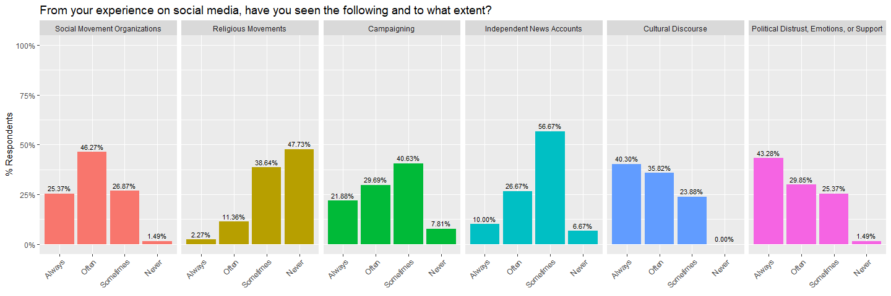

# Introduction

This code will visualize the data from the survey conducted by Jarek Azim. One thing to note here is that the survey was conducted on QuestionPro, whose export function is not friendly for R analysis. This makes digging deeper in the analysis difficult (e.g. seeing whether results stratified by nationality). QuestionPro better exported just the final data, but since that is very easy to just manually type here, that is what I will be doing.

# Data Import

First, loading in the libraries for organization and data visualization.


```r
# Load libraries
library(tidyverse)
library(RColorBrewer)
```

These next codes will be loading in the survey data. 


```r
# Create dataset
social_impact_data <- tibble(  
	Answer = c("Yes", 
	           "No", 
	           "Probably", 
	           "I've Never Noticed"), 
	Proportion = c(0.4932, 
	               0.0685, 
	               0.3699, 
	               0.0685)
)

social_impact_data
```

```
## # A tibble: 4 x 2
##   Answer             Proportion
##   <chr>                   <dbl>
## 1 Yes                    0.493 
## 2 No                     0.0685
## 3 Probably               0.370 
## 4 I've Never Noticed     0.0685
```


```r
# Create dataset
backlash_data <- tibble(Type = c("Historical Depictions", 
                                 "Historical Depictions", 
                                 "Historical Depictions", 
                                 "Historical Depictions", 
                                 "Historical Depictions", 
                                 "Political Insensitivity",
                                 "Political Insensitivity",
                                 "Political Insensitivity",
                                 "Political Insensitivity",
                                 "Political Insensitivity",
                                 "International Satire",
                                 "International Satire",
                                 "International Satire",
                                 "International Satire",
                                 "International Satire",
                                 "Discrimination",
                                 "Discrimination",
                                 "Discrimination",
                                 "Discrimination",
                                 "Discrimination",
                                 "Other",
                                 "Other",
                                 "Other",
                                 "Other",
                                 "Other"),
                        Answer = c("Often", 
                                   "Somewhat Often", 
                                   "Neutral", 
                                   "Somewhat Rare", 
                                   "Rare",
                                   "Often", 
                                   "Somewhat Often", 
                                   "Neutral", 
                                   "Somewhat Rare", 
                                   "Rare",
                                   "Often", 
                                   "Somewhat Often", 
                                   "Neutral", 
                                   "Somewhat Rare", 
                                   "Rare",
                                   "Often", 
                                   "Somewhat Often", 
                                   "Neutral", 
                                   "Somewhat Rare", 
                                   "Rare",
                                   "Often", 
                                   "Somewhat Often", 
                                   "Neutral", 
                                   "Somewhat Rare", 
                                   "Rare"),
                        Proportion = c(0.2958,
                                       0.4225,
                                       0.1268,
                                       0.1127,
                                       0.0423,
                                       0.4143,
                                       0.3857,
                                       0.1143,
                                       0.0571,
                                       0.0286,
                                       0.1449,
                                       0.2609,
                                       0.3913,
                                       0.1594,
                                       0.0435,
                                       0.4722,
                                       0.4167,
                                       0.056,
                                       0.056,
                                       0.00,
                                       0.1944,
                                       0.1389,
                                       0.6389,
                                       0.278,
                                       0.00)
)

backlash_data
```

```
## # A tibble: 25 x 3
##    Type                    Answer         Proportion
##    <chr>                   <chr>               <dbl>
##  1 Historical Depictions   Often              0.296 
##  2 Historical Depictions   Somewhat Often     0.422 
##  3 Historical Depictions   Neutral            0.127 
##  4 Historical Depictions   Somewhat Rare      0.113 
##  5 Historical Depictions   Rare               0.0423
##  6 Political Insensitivity Often              0.414 
##  7 Political Insensitivity Somewhat Often     0.386 
##  8 Political Insensitivity Neutral            0.114 
##  9 Political Insensitivity Somewhat Rare      0.0571
## 10 Political Insensitivity Rare               0.0286
## # ... with 15 more rows
```

```r
# Create dataset
groups_engaging_data <- tibble(Type = c("Individual Fans",
                                 "Individual Fans",
                                 "Individual Fans",
                                 "Individual Fans",
                                 "Individual Fans",
                                 "Fan Groups",
                                 "Fan Groups",
                                 "Fan Groups",
                                 "Fan Groups",
                                 "Fan Groups",
                                 "Media Representatives",
                                 "Media Representatives",
                                 "Media Representatives",
                                 "Media Representatives",
                                 "Media Representatives"),
                        Answer = c("Often", 
                                   "Somewhat Often", 
                                   "Neutral", 
                                   "Somewhat Rare", 
                                   "Rare",
                                   "Often", 
                                   "Somewhat Often", 
                                   "Neutral", 
                                   "Somewhat Rare", 
                                   "Rare",
                                   "Often", 
                                   "Somewhat Often", 
                                   "Neutral", 
                                   "Somewhat Rare", 
                                   "Rare"),
                        Proportion = c(0.2958,
                                       0.2958,
                                       0.2114,
                                       0.1127,
                                       0.0845,
                                       0.1014,
                                       0.3768,
                                       0.2319,
                                       0.2464,
                                       0.0435,
                                       0.0735,
                                       0.1765,
                                       0.2941,
                                       0.25,
                                       0.2059)
                        )
groups_engaging_data
```

```
## # A tibble: 15 x 3
##    Type                  Answer         Proportion
##    <chr>                 <chr>               <dbl>
##  1 Individual Fans       Often              0.296 
##  2 Individual Fans       Somewhat Often     0.296 
##  3 Individual Fans       Neutral            0.211 
##  4 Individual Fans       Somewhat Rare      0.113 
##  5 Individual Fans       Rare               0.0845
##  6 Fan Groups            Often              0.101 
##  7 Fan Groups            Somewhat Often     0.377 
##  8 Fan Groups            Neutral            0.232 
##  9 Fan Groups            Somewhat Rare      0.246 
## 10 Fan Groups            Rare               0.0435
## 11 Media Representatives Often              0.0735
## 12 Media Representatives Somewhat Often     0.176 
## 13 Media Representatives Neutral            0.294 
## 14 Media Representatives Somewhat Rare      0.25  
## 15 Media Representatives Rare               0.206
```

```r
# Create dataset
political_sns_data <- tibble(Type = c("Social Movement Organizations",
                                        "Social Movement Organizations",
                                        "Social Movement Organizations",
                                        "Social Movement Organizations",
                                        "Religious Movements",
                                        "Religious Movements",
                                        "Religious Movements",
                                        "Religious Movements",
                                        "Campaigning",
                                        "Campaigning",
                                        "Campaigning",
                                        "Campaigning",
                                        "Independent News Accounts",
                                        "Independent News Accounts",
                                        "Independent News Accounts",
                                        "Independent News Accounts",
                                        "Cultural Discourse",
                                        "Cultural Discourse",
                                        "Cultural Discourse",
                                        "Cultural Discourse",
                                        "Political Distrust, Emotions, or Support",
                                        "Political Distrust, Emotions, or Support",
                                        "Political Distrust, Emotions, or Support",
                                        "Political Distrust, Emotions, or Support"),
                               Answer = c("Never",
                                          "Sometimes",
                                          "Often",
                                          "Always",
                                          "Never",
                                          "Sometimes",
                                          "Often",
                                          "Always",
                                          "Never",
                                          "Sometimes",
                                          "Often",
                                          "Always",
                                          "Never",
                                          "Sometimes",
                                          "Often",
                                          "Always",
                                          "Never",
                                          "Sometimes",
                                          "Often",
                                          "Always",
                                          "Never",
                                          "Sometimes",
                                          "Often",
                                          "Always"),
                               Proportion = c(0.0149,
                                              0.2687,
                                              0.4627,
                                              0.2537,
                                              0.4773,
                                              0.3864,
                                              0.1136,
                                              0.0227,
                                              0.0781,
                                              0.4063,
                                              0.2969,
                                              0.2188,
                                              0.0667,
                                              0.5667,
                                              0.2667,
                                              0.10,
                                              0.00,
                                              0.2388,
                                              0.3582,
                                              0.4030,
                                              0.0149,
                                              0.2537,
                                              0.2985,
                                              0.4328)
)
political_sns_data
```

```
## # A tibble: 24 x 3
##    Type                          Answer    Proportion
##    <chr>                         <chr>          <dbl>
##  1 Social Movement Organizations Never         0.0149
##  2 Social Movement Organizations Sometimes     0.269 
##  3 Social Movement Organizations Often         0.463 
##  4 Social Movement Organizations Always        0.254 
##  5 Religious Movements           Never         0.477 
##  6 Religious Movements           Sometimes     0.386 
##  7 Religious Movements           Often         0.114 
##  8 Religious Movements           Always        0.0227
##  9 Campaigning                   Never         0.0781
## 10 Campaigning                   Sometimes     0.406 
## # ... with 14 more rows
```


# Data Preparation

In order to visualize the graphs in a particular order, the data `levels` will be explicitly defined.


```r
# Define order of answers that will be visualized
social_impact_data$Answer <- social_impact_data$Answer %>%
  factor(levels = c("Yes", "No", "Probably", "I've Never Noticed"))

backlash_data$Answer <- backlash_data$Answer %>%
  factor(levels = c("Often", "Somewhat Often", "Neutral", "Somewhat Rare", "Rare"))

backlash_data$Type <- backlash_data$Type %>%
  factor(levels = c("Historical Depictions", "Political Insensitivity", "International Satire", "Discrimination", "Other"))

groups_engaging_data$Answer <- groups_engaging_data$Answer %>%
  factor(levels = c("Often", "Somewhat Often", "Neutral", "Somewhat Rare", "Rare"))

groups_engaging_data$Type <- groups_engaging_data$Type %>%
  factor(levels = c("Individual Fans", "Fan Groups", "Media Representatives"))

political_sns_data$Answer <- political_sns_data$Answer %>%
  factor(levels = c("Always", "Often", "Sometimes","Never"))

political_sns_data$Type <- political_sns_data$Type %>%
  factor(levels = c("Social Movement Organizations", "Religious Movements", "Campaigning","Independent News Accounts","Cultural Discourse","Political Distrust, Emotions, or Support"))


# Check that all classes are factors

class(social_impact_data$Answer)
```

```
## [1] "factor"
```

```r
class(backlash_data$Answer)
```

```
## [1] "factor"
```

```r
class(backlash_data$Type)
```

```
## [1] "factor"
```

```r
class(groups_engaging_data$Answer)
```

```
## [1] "factor"
```

```r
class(groups_engaging_data$Type)
```

```
## [1] "factor"
```

```r
class(political_sns_data$Answer)
```

```
## [1] "factor"
```

```r
class(political_sns_data$Type)
```

```
## [1] "factor"
```


# Visualize Data

Now time to visualize the data. For some reason, font changes aren't working here. 


```r
# Social Media Impact Graph
social_impact_graph <- social_impact_data %>%
  ggplot(aes(x = Answer, y = Proportion, fill=Answer)) + 
  geom_bar(stat="identity", show.legend = FALSE) + 
  ggtitle('Do fan critics have an impact on political pressure, decisions, etc?') +
  ylab("% Respondents") + 
  scale_y_continuous(labels = scales::percent, limits=c(0,1))+
  geom_text(aes(label=scales::percent(Proportion), vjust=-0.3)) +
  theme(axis.title.x = element_blank(),
        plot.title = element_text(size=14))
```


```r
social_impact_graph
```

<!-- -->


```r
backlash_graph <- backlash_data %>%
  ggplot(aes(x= Answer, Group=Type)) + 
  geom_bar(show.legend = FALSE, aes(y = Proportion, fill = factor(Type)), stat="identity") + 
  geom_text(aes( label = scales::percent(Proportion),y= Proportion ), stat= "identity", vjust = -.5, size = 3) +
  ggtitle('How often do TV shows, music, movies, etc receive backlash from its fan community for:') +
  labs(y = "% Respondents", fill="Type") +
  facet_grid(~Type) +
  scale_y_continuous(labels = scales::percent,limits=c(0,1)) +
  theme(axis.title.x = element_blank(),
        axis.text.x = element_text(angle = 45, hjust = 1),
        plot.title = element_text(size=14))

backlash_graph
```

<!-- -->

```r
# Groups Engaging Graph
groups_engaging_graph <-groups_engaging_data %>%
  ggplot(aes(x= Answer, Group=Type)) + 
  geom_bar(show.legend = FALSE, aes(y = Proportion, fill = factor(Type)), stat="identity") + 
  geom_text(aes( label = scales::percent(Proportion),y= Proportion ), stat= "identity", vjust = -.5, size = 3) +
  ggtitle('How often do you experience fans and fandoms engaging in such political activities?') +
  labs(y = "% Respondents", fill="Type") +
  facet_grid(~Type) +
  scale_y_continuous(labels = scales::percent,limits=c(0,1)) +
  theme(axis.title.x = element_blank(),
        axis.text.x = element_text(angle = 45, hjust = 1),
        plot.title = element_text(size=14))

groups_engaging_graph
```

<!-- -->

```r
political_sns_graph <- political_sns_data %>%
  ggplot(aes(x= Answer, Group=Type)) + 
  geom_bar(show.legend = FALSE, aes(y = Proportion, fill = factor(Type)), stat="identity") + 
  geom_text(aes( label = scales::percent(Proportion),y= Proportion ), stat= "identity", vjust = -.5, size = 3) +
  ggtitle('From your experience on social media, have you seen the following and to what extent?') +
  labs(y = "% Respondents", fill="Type") +
  facet_grid(~Type) +
  scale_y_continuous(labels = scales::percent,limits=c(0,1)) +
  theme(axis.title.x = element_blank(),
        axis.text.x = element_text(angle = 45, hjust = 1),
        plot.title = element_text(size=14))
political_sns_graph
```

<!-- -->


---

```r
sessionInfo()
```

```
## R version 4.0.2 (2020-06-22)
## Platform: x86_64-w64-mingw32/x64 (64-bit)
## Running under: Windows 10 x64 (build 19043)
## 
## Matrix products: default
## 
## locale:
## [1] LC_COLLATE=English_United States.1252 
## [2] LC_CTYPE=English_United States.1252   
## [3] LC_MONETARY=English_United States.1252
## [4] LC_NUMERIC=C                          
## [5] LC_TIME=English_United States.1252    
## 
## attached base packages:
## [1] stats     graphics  grDevices utils     datasets  methods   base     
## 
## other attached packages:
##  [1] RColorBrewer_1.1-2 forcats_0.5.1      stringr_1.4.0      dplyr_1.0.5       
##  [5] purrr_0.3.4        readr_1.4.0        tidyr_1.1.3        tibble_3.1.1      
##  [9] ggplot2_3.3.3      tidyverse_1.3.1   
## 
## loaded via a namespace (and not attached):
##  [1] tidyselect_1.1.0  xfun_0.22         bslib_0.2.4       haven_2.4.1      
##  [5] colorspace_2.0-0  vctrs_0.3.7       generics_0.1.0    htmltools_0.5.1.1
##  [9] yaml_2.2.1        utf8_1.2.1        rlang_0.4.10      jquerylib_0.1.4  
## [13] pillar_1.6.0      glue_1.4.2        withr_2.4.2       DBI_1.1.1        
## [17] dbplyr_2.1.1      modelr_0.1.8      readxl_1.3.1      lifecycle_1.0.0  
## [21] munsell_0.5.0     gtable_0.3.0      cellranger_1.1.0  rvest_1.0.0      
## [25] evaluate_0.14     labeling_0.4.2    knitr_1.33        fansi_0.4.2      
## [29] highr_0.9         broom_0.7.6       Rcpp_1.0.6        backports_1.2.1  
## [33] scales_1.1.1      jsonlite_1.7.2    farver_2.1.0      fs_1.5.0         
## [37] hms_1.0.0         digest_0.6.27     stringi_1.5.3     grid_4.0.2       
## [41] cli_2.5.0         tools_4.0.2       magrittr_2.0.1    sass_0.3.1       
## [45] crayon_1.4.1      pkgconfig_2.0.3   ellipsis_0.3.1    xml2_1.3.2       
## [49] reprex_2.0.0      lubridate_1.7.10  assertthat_0.2.1  rmarkdown_2.7    
## [53] httr_1.4.2        rstudioapi_0.13   R6_2.5.0          compiler_4.0.2
```

